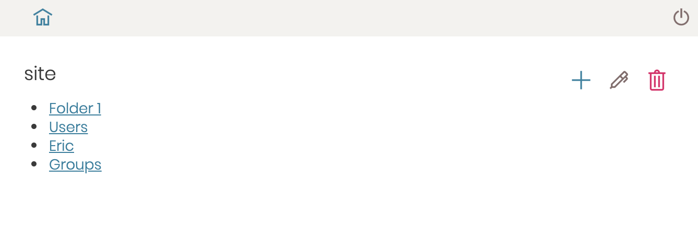
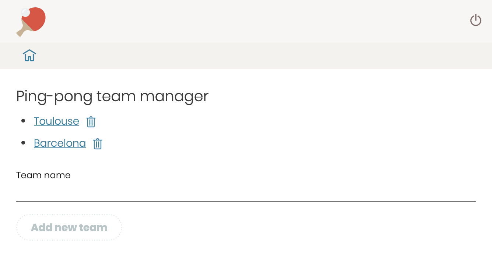
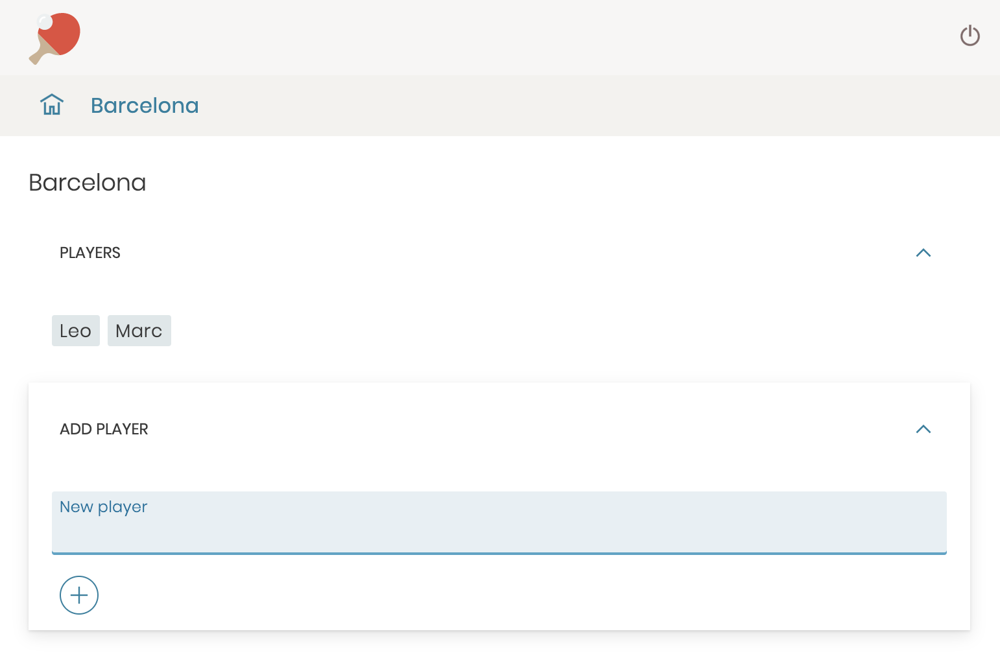
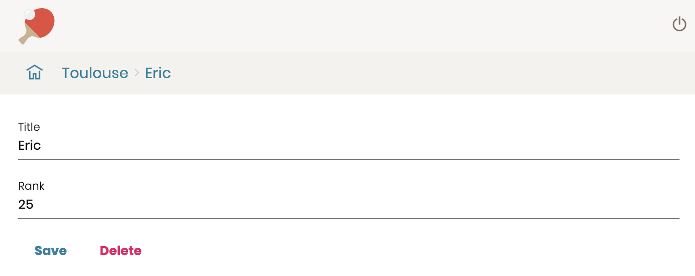
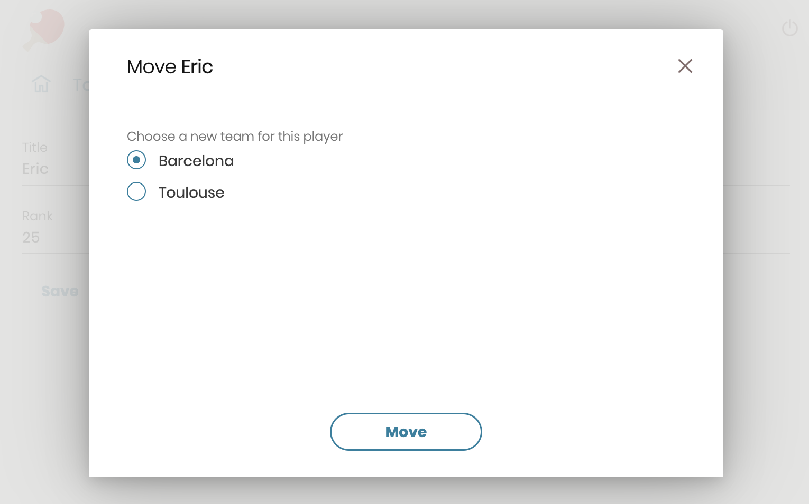
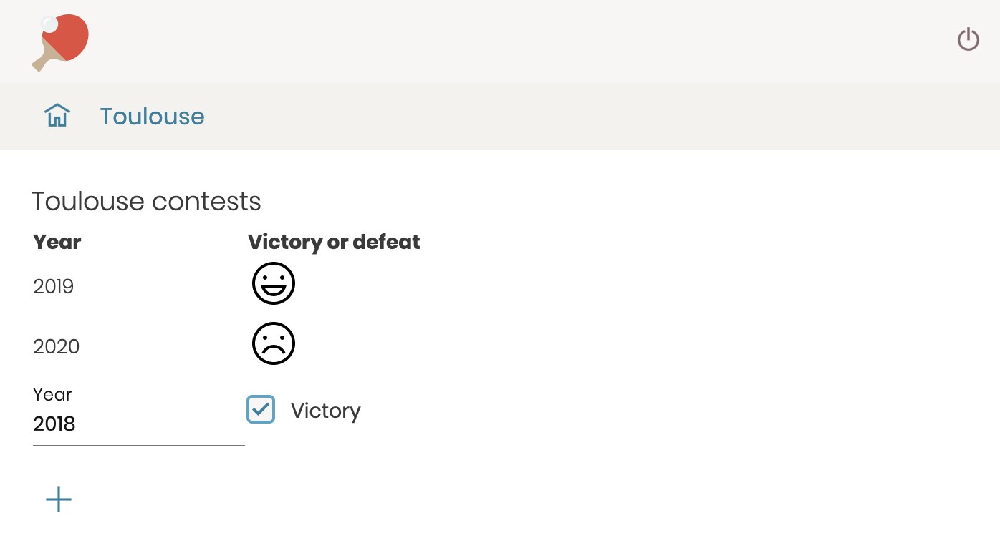

# Grange tutorial

## Get started

Create an angular project:

```bash
ng new my-project
```

In your Angular project, install Grange:

```
npm install @guillotinaweb/grange-schematic
ng add @guillotinaweb/grange-schematic
```

Run Guillotina (it requires Docker):

```bash
npm run guillotina
```

Import in the `app.module.ts` the Grange module plus a minimal NgRx store, and provide the Guillotina backend URL to our container:

```ts
import { GrangeRootModule } from '@guillotinaweb/grange';
import { TraversalModule } from 'angular-traversal';
import { StoreModule } from '@ngrx/store';

...
    imports: [
        ...
        GrangeRootModule.forRoot(),
        StoreModule.forRoot(
            {},
            {
                runtimeChecks: {
                    strictStateImmutability: false,
                    strictActionImmutability: false,
                },
            }
        ),
        TraversalModule,
    ],
    providers: [
        {
            provide: 'CONFIGURATION',
            useValue: {
                BACKEND_URL: 'http://127.0.0.1:8081/db/site',
                CLIENT_TIMEOUT: 5000,
            },
        },
    ],
```

Initialize the default views in `app.component.ts`:

```ts
export class AppComponent {
    constructor(private views: GrangeViews) {
        this.views.initialize();
    }
}
```

Set the `traverser-outlet` in `app.component.html`:

```html
<traverser-outlet></traverser-outlet>
```

Run the application:

```bash
npm start
```

Our Angular app is now offering all Grange standard views (login, content creation, view, etc.).
We can login as root/root. By clicking on the "Plus" button, we get the available content types and we can a new content.
Once created we can delete it or edit it. The edit form is automatically generated based on the content type schema provided by Guillotina.

Let's tweak a bit our app component.

`app.component.html`:

```html
<header>
    <pa-button *ngIf="isAuthenticated" (click)="logout()" icon="log-out" color="secondary"></pa-button>
</header>
<grange-breadcrumbs *ngIf="isAuthenticated"></grange-breadcrumbs>
<main>
    <traverser-outlet></traverser-outlet>
</main>
```

(to use `pa-button`, we must import `ButtonModule` in `app.module.ts`)

`app.component.scss`:

```scss
@import '~@guillotinaweb/pastanaga-angular/lib/styles/variables';

:host {
    display: block;

    header pa-button {
        float: right;
    }

    grange-breadcrumbs {
        background-color: $azure-light;
    }
    main {
        padding: rythm(2);
    }
}
```

`app.component.ts`:

```ts
import { Component } from '@angular/core';
import { GrangeViews, Grange } from '@guillotinaweb/grange';

@Component({
    selector: 'app-root',
    templateUrl: './app.component.html',
    styleUrls: ['./app.component.scss'],
})
export class AppComponent {
    isAuthenticated = false;

    constructor(private grange: Grange, private views: GrangeViews) {
        this.views.initialize();
        this.grange.core.auth.isAuthenticated.subscribe((auth) => (this.isAuthenticated = auth.state));
    }

    logout() {
        this.grange.core.auth.logout();
    }
}
```

Now we have a breadcrumb allowing to navigate from child content to parents, and a logout button.



See [the full code example](projects/simple-demo/src/app).

## Build a full app

### Declare custom Guillotina contents

We want an app to create an app to manage ping-pong teams.

Let's add in our Guillotina `config.yaml` file two custom content types named `player` and `team`:

```yaml
contents:
    player:
        title: Player
        inherited_interface: guillotina.interfaces.IItem
        inherited_class: guillotina.content.Item
        add_permission: guillotina.AddContent
        properties:
            rank:
                type: guillotina.schema.Int
                title: Rank
    team:
        title: Team
        inherited_interface: guillotina.interfaces.IFolder
        inherited_class: guillotina.content.Folder
        add_permission: guillotina.AddContent
        allowed_types:
            - player
        properties:
            contests:
                type: guillotina.schema.JSONField
                title: Contests
```

Player inherits from Guillotina `Item`, hence it will have an `@id` and a `title`, we just add an extra attribute named `rank` that will allow to store the player rank as an integer.

Team inherits from Guillotina `Folder`, so it can contain other contents. The `allowed_types` property allow us to specify a team can contain players.
We add a custom attribute named `contests` that will allow to store victories and defeats as a dictionary.

And let's create an app container for this new project:

```bash
curl -XPOST --user root:root http://127.0.0.1:8081/db -d '{
  "@type": "Container",
  "id": "ping-pong"
}'
```

We can now use http://127.0.0.1:8081/db/ping-pong as our `BACKEND_URL` in `app.module.ts`.

### Home page

Our home page must list all the existing teams and must allow to create a new team.

We create a regular Angular component named `TeamListComponent`:

```bash
ng generate component TeamList
```

It is declared it in `app.module.ts` as any Angular component, but we also register it in our `AppComponent` to become the `Container` default view:

```ts
this.grange.traverser.addView('view', 'Container', TeamListComponent);
```

That way, the Grange default container view is replaced by our own component

In the component itself, we inject `grange` service:

```ts
constructor(private grange: Grange) { }
```

To be able to create a new team, we add the following in the component template:

```html
<pa-input [(value)]="newTeam">Team name</pa-input>
<pa-button (click)="addTeam()" border [disabled]="!newTeam">Add new team</pa-button>
```

We use the Pastanaga buttons and inputs here, so we will have to import the needed Pastanaga modules in `app.module.ts`:

```ts
imports: [
    ...our other modules...,
    ButtonModule,
    TextFieldModule,
]
```

In the component, we add a `newTeam` property:

```ts
newTeam = '';
```

And we add an `addTeam` method:

```ts
addTeam() {
    this.grange.addInContext({'@type': 'team', title: this.newTeam, contests: {}});
}
```

Note: `addInContext` is a shortcut that gets the current context path and then calls the `grange.core.resource.create()` method. If the data we pass does not contain an `id`, an `id` will be generated by sanitizing the `title`.

Our existing teams will be managed in a property named `teams`, and we will update it by subscribing to an observable:

```ts
teams: Resource[];

constructor(private grange: Grange) {
    this.loadTeams().subscribe(teams => this.teams = teams);
}

loadTeams(): Observable<Resource[]> {
    return this.grange.core.resource.items('/').pipe(
        map(res => res.items
            .filter(item => item['@type'] === 'team')
        )
    );
}
```

The `items('/')` method from `resource` service allows to collect all the Guillotina contents in the container root, to make sure we only get teams, we filter the results according their `@type` value.

Now we can display the team list in our template:

```html
<ul>
    <li *ngFor="let team of (teams | async)">
        <a href="#" [traverseTo]="team['@id']">{{ team.title }}</a>
    </li>
</ul>
```

Important note:
Guillotina resources expose their full URL in `@id` attribute. Even though it is a backend URL (like `http://127.0.0.1:8081/db/ping-pong/teamA`), and not a front app path (like `http:/localhost:4200/teamA`), angular-traversal allows us to use it as a valid path to traverse. It will make the corresponding backend call and navigate to the equivalent front app path (`/teamA`) transparently. It is particularly handy to be able to use any backend URL as valid "links" in the app without having to convert them everytime.

We must fix the `addTeam` property in order to refresh the display after adding a new team:

```ts
addTeam() {
    this.grange.addInContext({'@type': 'team', title: this.newTeam, contests: {}}).onComplete.pipe(
        concatMap(() => this.loadTeams()),
    ).subscribe(teams => {
        this.teams = teams;
        this.newTeam = '';
    });
}
```

We also want to be able to delete a team:

```ts
delete(path: string) {
    this.grange.core.resource.delete(path).pipe(
        concatMap(() => this.loadTeams()),
    ).subscribe(teams => this.teams = teams);
}
```

The `delete()` method is called from a button next to each team link:

```html
<li *ngFor="let team of teams">
    <a href="#" [traverseTo]="team['@id']">{{ team.title }}</a>
    <pa-button size="small" icon="delete" (click)="delete(team['@id'])">Delete</pa-button>
</li>
```



### Team

When viewing a team, we want to list all the team players.

First, let's create a new component named `TeamComponent`, and register it in `app.component.ts`:

```ts
this.grange.traverser.addView('view', 'team', TeamComponent);
```

It means that anytime our local path (like `/team-ketchup`) corresponds to a backend resource – aka context – (which URL would be `http://127.0.0.1:8081/db/ping-pong/team-ketchup`) happens to be of type `'team'`, then we will use `TeamComponent` to render it.
That's the principle of traversing, by opposition to routing. With routing we define a path pattern for a given type of component, and we do the corresponding backend call. With traversing, we do not enforce any path pattern, any local path is mapped to its corresponding backend call, and according the type (and the view), we get the proper component.

By extending `FolderView` like this:

```ts
export class TeamComponent extends FolderView {}
```

`TeamComponent` is able to access team's players using the `children` observable:

```html
<pa-badge *ngFor="let player of (children | async)">{{player.title}}</pa-badge>
```

As we use Pastanaga badges here, we must import `BadgeModule` in `app.module.ts`.

We want to be able to add a new player, the implementation will be similar to adding a team:

```ts
export class TeamComponent extends FolderView {
    newPlayer = '';

    addPlayer() {
        this.grange
            .addInContext({
                '@type': 'player',
                title: this.newPlayer,
            })
            .onComplete.subscribe((success) => {
                if (success) {
                    this.refreshChildren();
                    this.newPlayer = '';
                }
            });
    }
}
```

Note we do not need the equivalent of `loadTeams` method here, as we just use the `refreshChildren` provided by `FolderView`.

To make it look better, let's use Pastanaga expand panels (note: we must import `ExpandModule` plus Angular's `BrowserAnimationsModule` in `app.module.ts`):

```html
<h2>{{ (context | async).title }}</h2>
<pa-expand [openOnInit]="true">
    <expand-title>Players</expand-title>
    <pa-badge *ngFor="let player of (children | async)" [traverseTo]="player['@id'] + '/@@edit'"
        >{{player.title}}</pa-badge
    >
</pa-expand>
<pa-expand>
    <expand-title>Add player</expand-title>
    <pa-input [(value)]="newPlayer">New player</pa-input>
    <pa-button (click)="addPlayer()" size="small" border icon="add"></pa-button>
</pa-expand>
```



Note badges are now links to traverse to players "edit" view:

```html
[traverseTo]="player['@id'] + '/@@edit'"
```

But if we click, we get the default Pastanaga Edit view, and we want our own form here. Let's implement a component for that.

### Player

We create `PlayerComponent` and register it in `app.component.ts`:

```ts
this.grange.traverser.addView('edit', 'player', PlayerComponent);
```

This component is a form allowing to enter player's name and rank or to delete the player:

```html
<pa-input [(value)]="title">Title</pa-input>
<pa-input [(value)]="rank" type="number">Rank</pa-input>
<pa-button (click)="save()">Save</pa-button>
<pa-button (click)="delete()" color="destructive">Delete</pa-button>
```

Let's make it extend `ViewView` so we can access the view context easily. The context is always typed as `any`.
As we know the context is a player object, it would be nice to map it to a custom `Player` interface:

```ts
interface Player extends Resource {
    rank: number;
}

@Component({
    selector: 'app-player',
    templateUrl: 'player.component.html',
})
export class PlayerComponent extends ViewView implements OnInit {
    title = '';
    rank = 0;
    player = this.context.pipe(map((res) => res as Player));
}
```

Now let's get the current title and rank values from the context:

```ts
ngOnInit() {
    this.player.subscribe(context => {
        this.title = context.title;
        this.rank = context.rank;
    });
}
```

The good thing about `this.player` is it returns an Observable that will emit the context object everytime it changes in our state, so our form is always reflecting the current state values.

`grange` service also allows us to save the changes the user enters in the form:

```ts
save() {
    this.grange.updateContext({
        title: this.title,
        rank: this.rank,
    });
}
```

`updateContext()` updates the state (hence the form is immediately updated because `this.player` will emit the new values), and it also updates Guillotina backend by doing a PATCH call.

If we want to take an action after saving – like redirecting to the home page – `updateContext()` has a `onComplete` property which is a boolean observable (returning `true` for success, and `false` if saving produced a backend error):

```ts
save() {
    this.grange.updateContext({
        title: this.title,
        rank: this.rank,
    }).onComplete.subscribe(success => {
        if (success) {
            this.grange.ui.toaster.open('Saved', 2000);
            this.grange.traverser.traverse('..');
        } else {
            this.grange.ui.toaster.open('Error when saving.', 'common.dismiss');
        }
    });
}
```

We use the Pastanage `toaster` service via `grange.ui` to display toast messages.
And in case of successfull update, we redirect to the parent team page by traversing to `..`.

To implement the `delete` method, we use `deleteContext`:

```ts
delete() {
    this.grange.deleteContext().onComplete.subscribe(success => {
        if (success) {
            this.grange.traverser.traverse('..');
        }
    });
}
```



### Move player to another team

We want now to be able to move a player from one team to another.
And we want to perform this action from a dialog box we open from the Player component.

We create a component named `MovePlayerComponent` (we do not register it in `app.component.ts` because it is not a traversable view).

The dialog contains a radio button list to select the new team:

```html
<pa-dialog>
    <pa-dialog-title>Move <strong>{{ (player | async).title }}</strong></pa-dialog-title>
    <pa-checkbox-group type="radio" [checkboxes]="teams | async" (selection)="newTeam = $event[0]"
        >Choose a new team for this player</pa-checkbox-group
    >
    <pa-dialog-footer>
        <pa-button border (click)="move()">Move</pa-button>
    </pa-dialog-footer>
</pa-dialog>
```

To be able to use those Pastanaga elements, we must import `DialogModule` and `ControlsModule` in `app.module.ts`.

The component must implements `IDialog` and will access the dialog component through a ViewChild:

```ts
export class MovePlayerComponent implements IDialog {
    @ViewChild(DialogComponent, { static: true }) dialog: DialogComponent | undefined;
}
```

It is not a view, so we will have to inject the Grange service ourselves:

```ts
constructor(private grange: Grange) { }
```

We get the current player fromn the context (and add a `newTeam` attribute to store the user's selection):

```ts
player = this.grange.getContext();
newTeam = '';
```

To create the list of radio buttons, we get all the items from our Guillotina root container that are Teams and we map them to `ControlModel`:

```ts
teams: Observable<ControlModel[]> = this.grange.core.resource.items('/').pipe(
        map(res => res.items
            .filter(item => item['@type'] === 'team')
            .map(team => new ControlModel({
                id: team['@id'],
                value: team['@id'],
                label: team.title,
            }))
        )
    );
```

The `move` method is implemented using the `moveTo` method from `grange.core.resource`:

```ts
move() {
    this.player.pipe(take(1)).pipe(
        concatMap(player => this.grange.core.resource.moveTo(player['@id'], this.newTeam))
    ).subscribe(() => this.dialog.close(this.newTeam));
}
```

Now our dialog is ready, but we must implement in `PlayerComponent` a way to open it.

In `player.component.html` we add a button:

```html
<pa-button (click)="openDialog()" color="secondary">Move to other team</pa-button>
```

And in `player.component.ts` we call `this.grange.ui.dialog.openDialog`:

```ts
openDialog() {
    this.grange.ui.dialog.openDialog(MovePlayerComponent).onClose.subscribe(teamPath => {
        if (!!teamPath) {
            this.grange.traverser.traverse(teamPath);
        }
    });
}
```

Note in `MovePlayerComponent` we closed the dialog returning the new team path:

```ts
this.dialog.close(this.newTeam);
```

And that's the value we get when subscribing here to `onClose`, allowing us to redirect to the corresponding team.



### Team contests

Until now, we have created custom components to override default Grange views (like `view` or `edit`).

But we are free to create any view we want.

We need to enter the ping-pong contests victories and defeats for each team.

Let's create `TeamContestsComponent`, and register it in `app.component.ts` to become the `contest` view for `team` contents:

```ts
this.grange.traverser.addView('contests', 'team', TeamContestsComponent);
```

In `team.component.html`, we add a button to traverse to this new view:

```html
<pa-button traverseTo="./@@contests">View contests</pa-button>
```

This view displays all team contests in a table, and the last table row allows to add a new one (or update an existing one if we enter an existing year):

```html
<table>
    <tr>
        <th>Year</th>
        <th>Victory or defeat</th>
    </tr>
    <tr *ngFor="let contest of (contests | async)">
        <td>{{ contest[0] }}</td>
        <td>
            <pa-icon *ngIf="contest[1]" name="delighted"></pa-icon>
            <pa-icon *ngIf="!contest[1]" name="dissatisfied"></pa-icon>
        </td>
    </tr>
    <tr>
        <td><pa-input [(value)]="year">Year</pa-input></td>
        <td><pa-checkbox [(selected)]="victory">Victory</pa-checkbox></td>
    </tr>
    <tr>
        <td><pa-button (click)="addContest()" icon="add" [disabled]="!year"></pa-button></td>
    </tr>
</table>
```

Note: to use `pa-icon`, we have to import `SvgModule` in `app.module.ts`.

`TeamContestsComponent` extends `ViewView` so we can use the context, and we get the `contests` value (which is a dictionnary) and turn it into a list.

```ts
export class TeamContestsComponent extends ViewView {
    year = '';
    victory = false;

    contests = this.context.pipe(map((context) => Object.entries(context['contests'] || {})));

    addContest() {
        this.grange.updateContext({ contests: { [this.year]: this.victory } });
        this.year = '';
        this.victory = false;
    }
}
```

The `addContest` method uses `updateContext` to update the `contests` attribute in our current team.
Note we just pass the updated entry, not the full dictionnary.
As `updateContext` will update the state, `this.context` will emit a new value, so `contests` will be refreshed automatically in our template.



See [the full code example](projects/demo/src/app).
